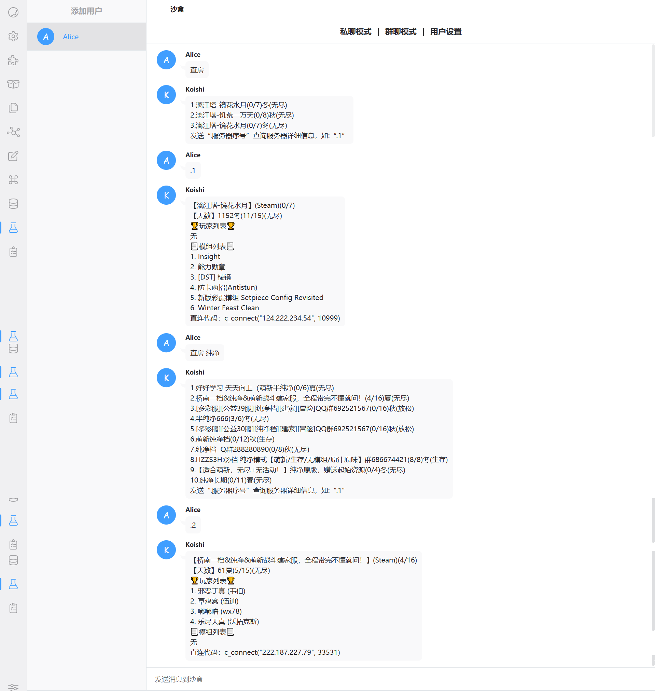

# koishi-plugin-dst-search

## 功能介绍 🚀
> 插件提供了以下两个查询饥荒联机服务器信息的命令，并且对于设置的默认的房间进行数据库自动缓存，达到几乎秒查的速度（沙盒模式，实际场景可能会有所不同）
### 1. 查询饥荒联机服务器简略信息（模糊匹配）🔎
---
- 指令：``s-simple [name]``

- 快捷指令：`查房` 或 `查房 房间名`

>  - `查房`：查询的是默认设置的房间，可以在配置插件页面自己配置，可以一个，也可以多个
> - `查房 房间名`：查询你想查询的房间名，如`查房 纯净`

### 2. 查询饥荒联机单个服务器详细信息（先进行简单查询）🔎
---
- 指令：s-detail [number]

- 快捷指令：`.序号` 或 `。序号`，例如`.1`或`。1`

> 根据每个用户所进行的简单查询查询结果进行具体查询

## 功能演示✨

