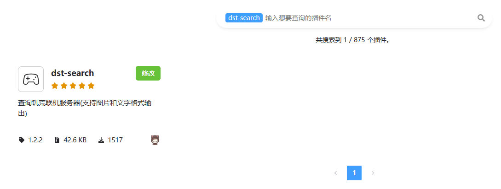
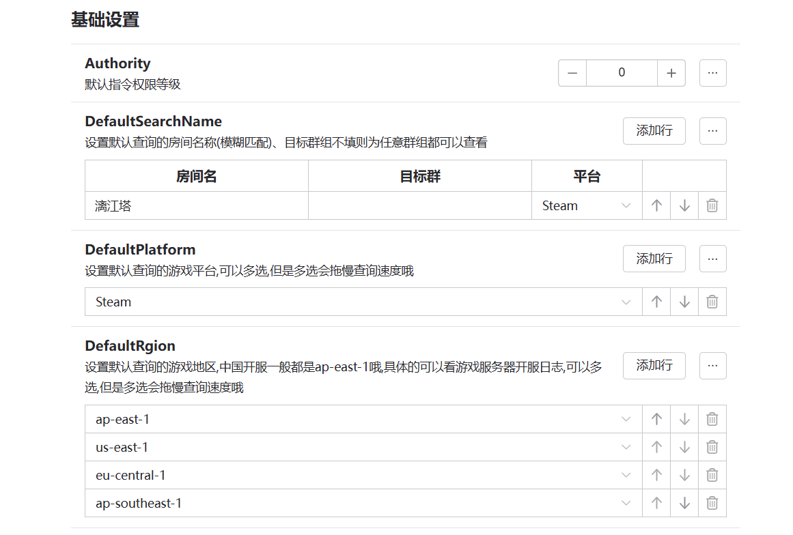
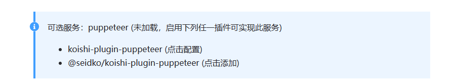
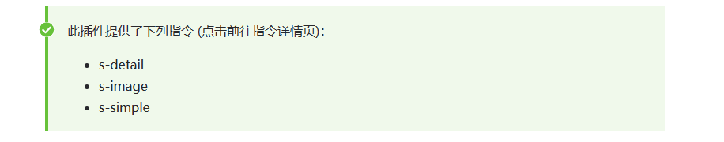
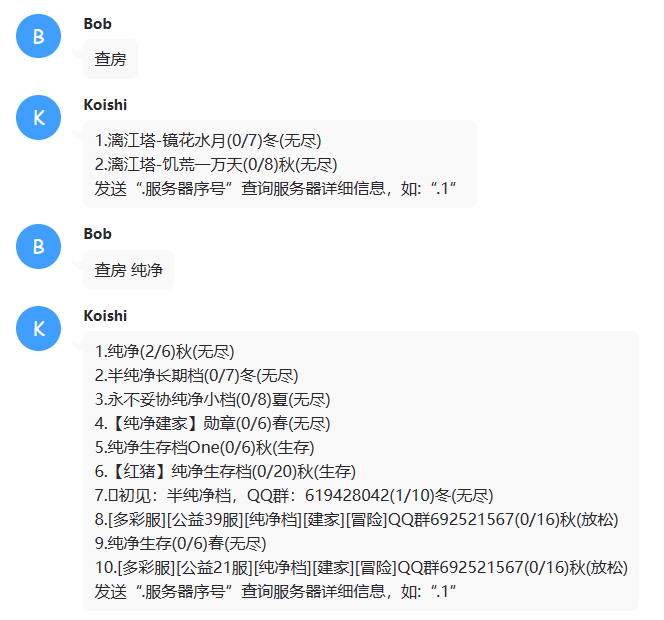
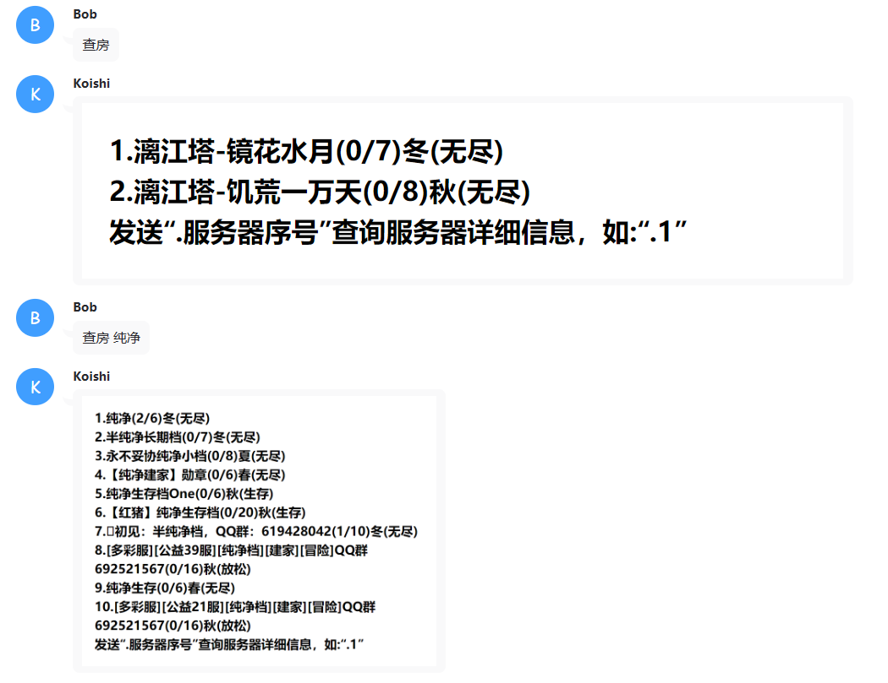
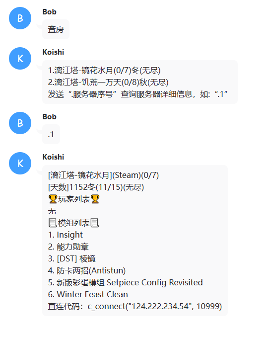
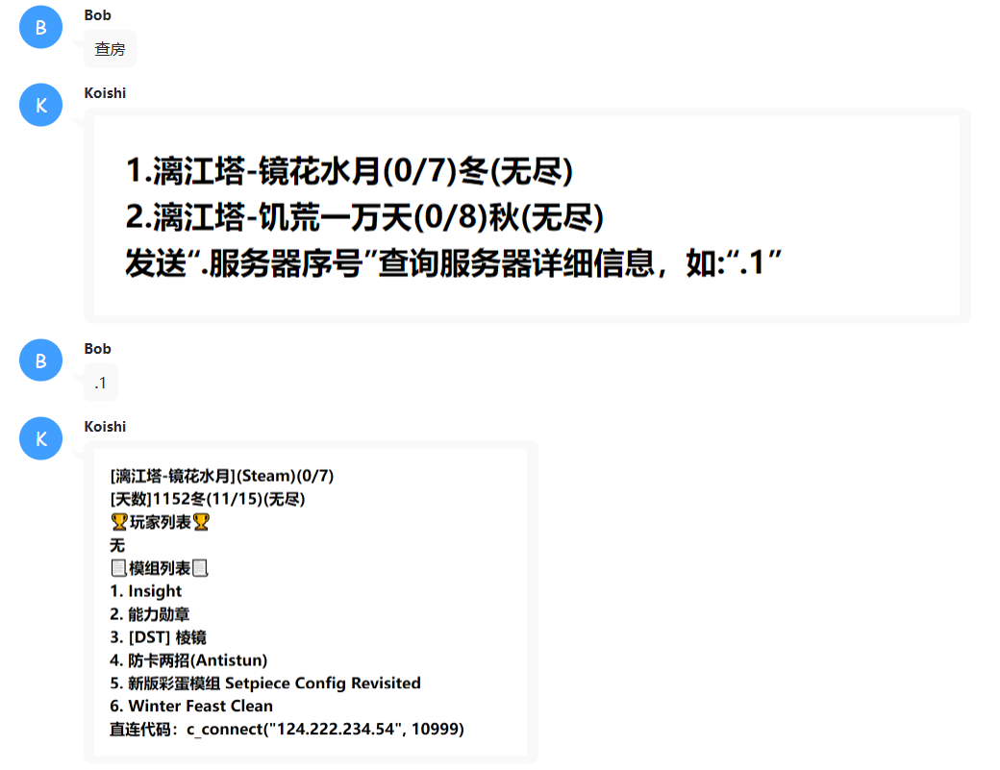
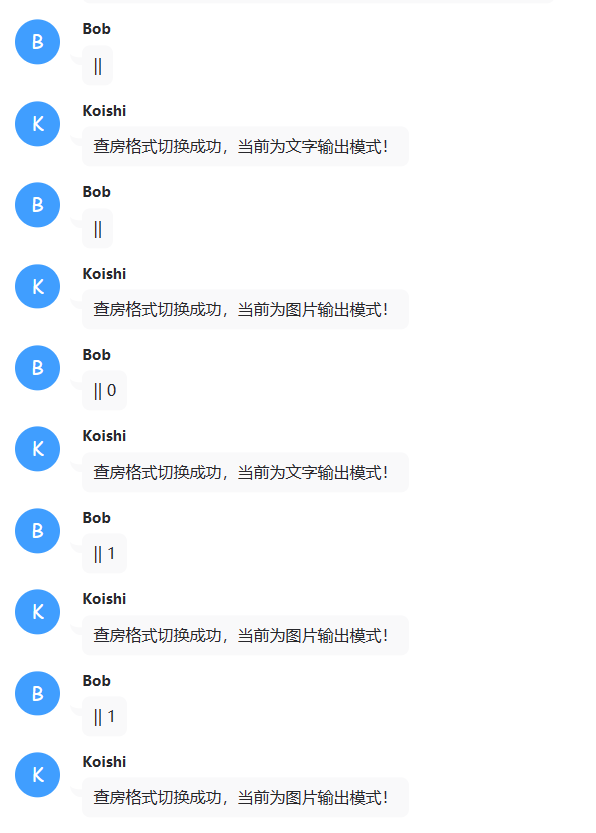

# koishi-plugin-dst-search

[](https://www.npmjs.com/package/koishi-plugin-dst-search)

## 使用教程🚀

### 1. 插件市场搜索**dst-search**并订阅



### 2. 配置默认参数



这些参数都是可以自定义的，请按需定义  
可以实现设置指定群查指定的平台的房间  
指定群只能查指定平台（群和平台填上，房间名留空即可

> Tips：如果突然不能用了，可能是我提供的Token被弃用了，换成自己的就可以了

### 3. 发送图片的设置(可选，并且不是特别建议使用)

你将看到可选服务的状态，**开启这个服务之后才能发送图片**，并且当前的图片发送在QQ上有点问题，问题原因可能出现在图片的尺寸上，**当你要发送的内容足够多时，才能正常发送图片**


### 4. 启动插件并等待出现以下样式出现即可正常使用



## 功能介绍 🚀
>
> 本插件为[Koishi](https://koishi.chat/zh-CN/)插件，插件提供了以下两个查询饥荒联机服务器信息的命令，并且对于设置的默认的房间进行数据库自动缓存，达到几乎秒查的速度（沙盒模式，实际场景可能会有所不同）,支持图片格式和文字格式的输出，图片格式输出较文字输出要慢一点，图片转换依赖于`puppeteer`

### 1. 查询饥荒联机服务器简略信息（模糊匹配）🔎

---

- 指令：``s-simple [name]``

- 快捷指令：`查房` 或 `查房 房间名`

> - `查房`：查询的是默认设置的房间，可以在配置插件页面自己配置，可以一个，也可以多个
> - `查房 房间名`：查询你想查询的房间名，如`查房 纯净`

### 2. 查询饥荒联机单个服务器详细信息（先进行简单查询）🔎

---

- 指令：s-detail [number]

- 快捷指令：`.序号` 或 `。序号`
- 例子：`.1`或`。1`

> 根据每个用户所进行的简单查询查询结果进行具体查询

### 3. 更改输出格式（文字或图片）🔄

---

- 指令：s-image [flag]

- 快捷指令：`||` 或 `|| 0|1`
- 例子：`|| 0`、`|| 1`

> - `|| 0`：以文字格式输出，即不以图片格式输出
> - `|| 1`：以图片格式输出

### 4. DST 控房与多用户权限

配置 `WSSPort`、`WSSUserList` 后，可以使用 `控房 <服务器或代称> <命令>` 向已连接的 `dst-ws-client` 发送控制命令。

`WSSUserList` 中的 `允许操作的用户` 支持填写多个 Koishi 用户 ID，例如：

```yaml
WSSUserList:
  - 名称: "本机"
    允许操作的用户: "123456789,987654321"
    Token: "test-token"
```

多个 ID 也可以使用中文逗号、顿号、分号、空格或换行分隔。Koishi 或插件重启时，插件会主动关闭旧的 WebSocket 客户端连接；`dst-ws-client` 检测到断开后会按 `clientReconnectMs` 自动重连。

同一个 DST 客户端一次只处理一条控制命令；上一条命令完成后，其他用户即可继续操作，执行结果会返回给对应的发起用户。

## 功能演示✨

### 1. 简略信息（模糊匹配）🔎

#### 简略信息文字类型🔎



#### 简略信息图片类型🔎



### 2. 详细信息（先进行简单查询）🔎

#### 详细信息文字类型🔎



#### 详细信息图片类型🔎



### 3. 输出格式更改（文字或图片）🔄



## 联系作者🔊

- QQ: `1549737287`
- QQ群: `456906519`
- QQ频道: `wj688gqy86`
